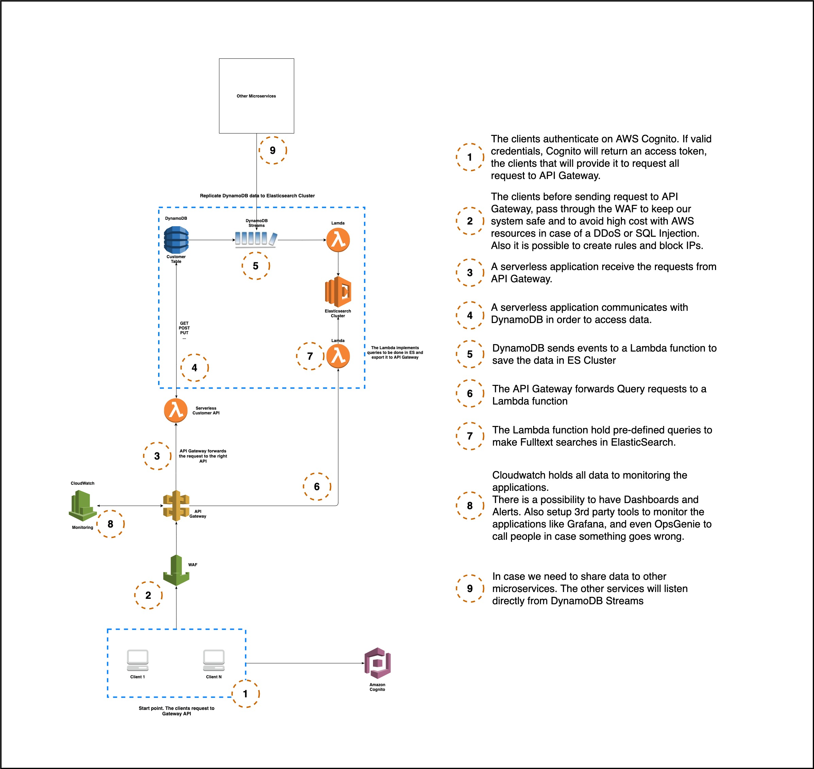

# Pagaleve Customers

Follows 2 implementations:
- customers-api -> A backend REST API using Kotlin and Spring Boot
- customer-api-serverless -> An API fully on AWS using NodeJS with Typescript, DynamoDB, API Gateway, and Lambda Functions

## The AWS Architecture I thought

## Important Notes:

Some Important Notes:

I did my best to have everything setup in a short time box. The things I could not cover I wrote it down how I would do that. I hope you enjoy, and if you have any question, please just call me.

The microservices in cloud ecosystem should follow a framework, such as the AWS Well architecture that will explain 5 pillars of a well architecture for our services:

1 - Operational Excellence
2 - Security
3 - Reliability
4 - Performance Efficiency
5 - Cost Optimization

Those pillars are basically design patterns for AWS Services architecture.

https://aws.amazon.com/blogs/apn/the-5-pillars-of-the-aws-well-architected-framework/

Kotlin Service Security

I would use Spring Security with Users and Roles to control who has access to the resources and who can proceed with some actions.      
For instance: Just tokens registered to Users with role ADMIN will be allowed to delete customers.   

- In case no token provided or invalid/expired token in a request, then the REST API service would return status code 401.   
- In case of the token is valid, but the user behind has no permission to accomplish the action, then the service would return status code 403.   

Inside the microservices ecosystem there is a possibility to have an authentication service will register and maintain the users and generate JWT tokens to be interpreted among all services inside this ecosystem.   

Elastic Search Fulltext search   

I could not setup the ES to present the endpoint to GET customers by all attributes.   
In this point I would use the Fulltext search using Elastic Search or any other Search engine.   
If we decide to go ES connected to a backend service, I would create another service separated from the CustomerService, called like CustomerSearchService, then I would have customer queries designed thinking in our need.   
Then the CustomerService would connect using an SDK of the CustomerSearchService exposing an endpoint to clients.      

CI/CD   

I love the idea to have as much release as possible. Of course, some precautions must be in place before going deep in this journey.   
The first thing is guarantee the services are reliable, and we do that with high testing coverage, following the pyramid of testing, passing through load and performance testing and ending in a beta testing (final customer tests for us).   
When I say the final customer tests, I meant it behind a safe tool like Spinnaker or other does Canary Deployment.   
And of course, feature toggle for new features, controlled by a tool like Helm to toggle it on or off in production.   
Once we built the part above, I would go with an auto deploy approach. Everything that touches the main branch, is considered in production, since it will trigger a production release.   
The trigger tool could be Travis, Gitlab or even Jenkins( please no :D ).   

Also, it is very important to have a reliable tool to create environments like Cloudformation or Terraform. If we go full cloud ecosystem, maybe Serverless is a nice catch.   

We can also control how many deployments we have per week/month (per service/per team/etc), sending a request to a database every single time the CI Tool triggers a release request.   

Cloud Security   

For cloud security I would use Cognito for client authentication, since it return an access token to be forwarded in consecutive requests to an API Gateway.   
And even before the client hits the API Gateway it is possible to add another safe tool in between, called WAF. It is responsible for detecting DDoS, SQL Injection and other types of hack trials. It also allows us to block IPs, or even an entire country if we want.   
Furthermore, the API Gateway will redirect the request to Cognito to check the access token via Oauth2 and in case of success, goes to a Lambda function (that could be an REST API) or ElasticSearch to a Fulltext search.   
The API Gateway also provides JWT tokens for other services.   

Scalability   

If we go with Lambda and DynamoDB, not much to worries about, it will auto-scale.   
I only recommend having a limit to scale, otherwise something could be happening, and the costs are huge.   
For backend API is also very chill to have auto scalability, using Kubernetes (EKS) or maybe SpotInstance would handle the case.   

Monitoring, Alerts, Dashboards and Firefighting   

Monitoring is one of the biggest thing currently, it provides realtime info about our services and with the same data it is possible to create dashboards and alerts integrated to a third-party tool like OpsGenie to call the firefighter.    
The hero of the week. That will wake up at 3 am if necessary to fix problems in production.   

Serverless   

I create a small service using serverless templates. It creates the Cloudformation file and deploy to S3 Bucket in AWS. On AWS it is executed and run the cloudformation file creating the DynamoDB Table, API Gateway resources and Lambda Functions.   

  